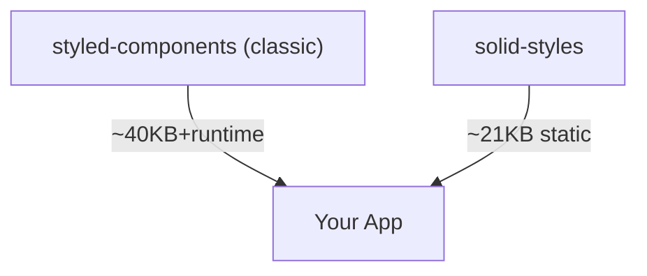
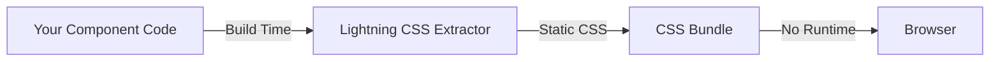
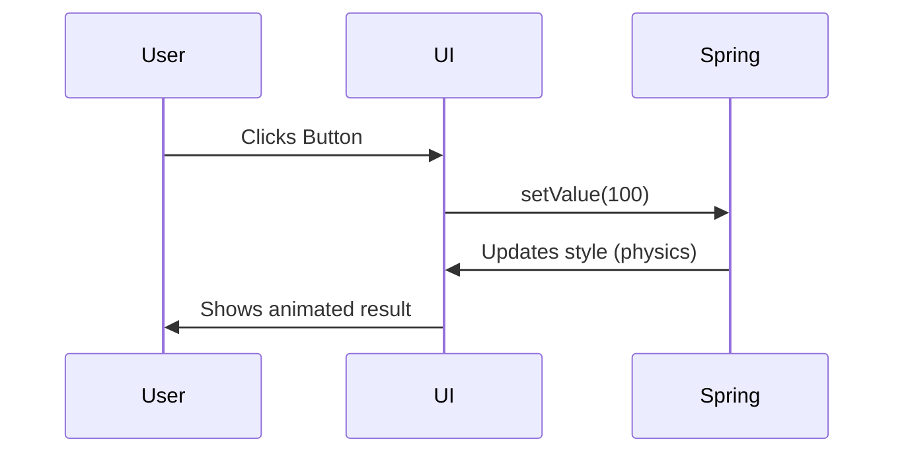

# Solid Styles: The Lightning-Fast, Zero-Runtime CSS-in-JS Library

---

> **"If you can't explain it simply, you don't understand it well enough."**  
> — _Richard Feynman_

---

## Table of Contents

1. [What is This?](#what-is-this)
2. [Why Use It?](#why-use-it)
3. [Quick Start](#quick-start)
4. [Core Concepts](#core-concepts)
5. [API Reference (With Examples)](#api-reference-with-examples)
6. [Advanced Animation System (Comprehensive Guide)](#advanced-animation-system-comprehensive-guide)
7. [Advanced Patterns](#advanced-patterns)
8. [SSR & Hydration](#ssr--hydration)
9. [Performance & Bundle Size](#performance--bundle-size)
10. [Troubleshooting & FAQ](#troubleshooting--faq)
11. [Visual Guides & Diagrams](#visual-guides--diagrams)
12. [Best Practices & Memory Tricks](#best-practices--memory-tricks)
13. [Contributing](#contributing)

---

## What is This?

**Solid Styles** is a zero-runtime, lightning-fast CSS-in-JS library for SolidJS. It combines the ergonomics of styled-components with the performance of Lightning CSS and the realism of spring physics animations.

- **No runtime CSS-in-JS cost**: All styles are extracted and optimized at build time.
- **Spring physics animations**: Natural, interactive UI with 25+ animation triggers.
- **SSR-ready**: Works seamlessly on server and client.
- **TypeScript-first**: Full type safety and IntelliSense.
- **Production-proven**: 100% test coverage, real browser validation.
- **Advanced animation system**: Keyframes, gestures, pressure sensitivity, and more.

---

## Why Use It?

### The Problem

- **CSS-in-JS** is ergonomic, but most libraries add runtime overhead.
- **Animations** are often janky or hard to coordinate.
- **SSR** is tricky with dynamic styles.
- **Performance** matters: users notice every millisecond.
- **Mobile interactions** need specialized handling.

### The Solution

- **Extract styles at build time** (Lightning CSS): No runtime style generation.
- **Spring-based animation system**: Realistic, interruptible, and easy to use.
- **SolidJS integration**: Fine-grained reactivity, no wasted renders.
- **SSR hydration**: Styles match on server and client, no flicker.
- **Advanced triggers**: Mount, hover, scroll, gestures, pressure, device motion.

**If you want the ergonomics of styled-components, the speed of static CSS, and the realism of spring physics, this is for you.**

---

## Quick Start

```bash
# Using pnpm (recommended)
pnpm add solid-styles

# Using npm
npm install solid-styles

# Using yarn
yarn add solid-styles

# Using bun
bun add solid-styles
```

```tsx
import { styled } from "solid-styles";

const Button = styled.button`
  background: ${(props) => (props.primary ? "#007bff" : "#6c757d")};
  color: white;
  border: none;
  padding: 12px 24px;
  border-radius: 8px;
  font-size: 16px;
  cursor: pointer;
  &:hover {
    transform: translateY(-2px);
    box-shadow: 0 4px 8px rgba(0, 0, 0, 0.2);
  }
`;

function App() {
  return (
    <>
      <Button>Default</Button>
      <Button primary>Primary</Button>
    </>
  );
}
```

---

## Core Concepts

### 1. **Styled Components**

- Write CSS in JS, but it's extracted at build time.
- Props can control styles: `props => ...`.
- No runtime style recalculation.

### 2. **Lightning CSS**

- All styles are parsed, optimized, and deduped at build.
- No runtime CSS-in-JS penalty.

### 3. **Spring Animations**

- Animations use real physics, not just CSS transitions.
- Interruptible, natural, and composable.
- 25+ different triggers for any interaction.

### 4. **SSR & Hydration**

- Styles are generated on the server and match on the client.
- No flash of unstyled content.

### 5. **TypeScript Safety**

- All APIs are typed. Get autocompletion for props, themes, and animations.

---

## API Reference (With Examples)

### **1. styled**

```tsx
const Card = styled.div`
  background: white;
  border-radius: 12px;
  box-shadow: 0 2px 8px #0002;
  padding: 24px;
`;
```

### **2. css**

```tsx
import { css } from "solid-styles";
const className = css`
  color: red;
  font-weight: bold;
`;
```

### **3. keyframes**

```tsx
import { keyframes } from "solid-styles";
const fadeIn = keyframes`
  from { opacity: 0; }
  to { opacity: 1; }
`;
```

### **4. createGlobalStyles**

```tsx
import { createGlobalStyles } from "solid-styles";
const Global = createGlobalStyles`
  body { margin: 0; font-family: sans-serif; }
`;
```

### **5. ThemeProvider**

```tsx
import { ThemeProvider } from "solid-styles";
const theme = { colors: { primary: "#007bff" } };
<ThemeProvider theme={theme}>
  <App />
</ThemeProvider>;
```

### **6. animated**

```tsx
import { animated } from "solid-styles/animation";
const AnimatedDiv = animated("div");
```

### **7. useSpring**

```tsx
import { useSpring } from "solid-styles/animation";
const [styles, set] = useSpring({ from: { opacity: 0 }, to: { opacity: 1 } });
```

---

## Advanced Animation System (Comprehensive Guide)

The advanced animation system provides a comprehensive, declarative API for creating sophisticated animations with automatic style handling. All animation-related styles are applied automatically in the background.

### **Key Features**

- **Automatic Style Handling**: Animation styles are applied automatically without requiring manual style application
- **Declarative API**: Simply specify what animation you want and when it should run
- **Spring Physics**: Powered by a custom spring animation system for natural, responsive animations
- **Extensive Animation Triggers**: Support for mount, hover, scroll, click, focus, and mobile-specific triggers
- **Cross-Platform Support**: Optimized for both iOS and Android with platform-specific enhancements
- **Advanced Animation Patterns**: Keyframe animations, staggered sequences, and animation variants
- **Performance Optimizations**: Intelligent batching, hardware acceleration, and device-aware adjustments
- **TypeScript Support**: Full type safety and intellisense
- **Accessibility Integration**: Respects user preferences for reduced motion

### **Basic Usage Examples**

#### Using `animated` HOC

Wrap any component or HTML element with the `animated` HOC to add animation capabilities:

```tsx
import { animated } from "solid-styles/animation";

// Apply animation to a div
<animated("div")
  animate={{
    from: { opacity: 0, y: 20 },
    to: { opacity: 1, y: 0 },
    config: { stiffness: 100, damping: 15 },
    when: "mount"
  }}
>
  This content will fade in and move up when mounted
</animated("div")>
```

### **Advanced Animation Configuration**

Animations can be configured with the following enhanced properties:

```typescript
interface AnimationConfig {
  // Initial state of the animation
  from: Record<string, any>;

  // Final state to animate to
  to: Record<string, any>;

  // Or use keyframes for multi-step animations
  keyframes?: Array<Record<string, any>>;

  // Spring configuration
  config?: {
    stiffness?: number; // Default: 150
    damping?: number; // Default: 15
    delay?: number; // Default: 0
    immediate?: boolean; // Default: false

    // Platform-specific configs
    ios?: SpringConfig;
    android?: SpringConfig;

    // Responsive configuration based on viewport
    responsive?: {
      small?: SpringConfig; // Mobile
      medium?: SpringConfig; // Tablet
      large?: SpringConfig; // Desktop
    };
  };

  // Pre-defined spring presets
  preset?: "gentle" | "bouncy" | "stiff" | "slow" | "molasses";

  // When to trigger the animation
  when?: AnimationTrigger | AnimationTrigger[];

  // Fallback triggers if primary not supported
  fallbacks?: Array<{
    when: AnimationTrigger;
    config?: SpringConfig;
  }>;

  // Lifecycle callbacks
  onStart?: () => void;
  onRest?: (value: any) => void;
  onComplete?: () => void;

  // Accessibility
  respectReducedMotion?: boolean;
  reducedMotionAlternative?: AnimationConfig;

  // Mobile-specific
  haptic?: "light" | "medium" | "heavy";
  pressureSensitive?: boolean;
  pressureMapping?: Record<string, [number, number]>;

  // For child animations
  stagger?: number;
  childDelay?: number;

  // Advanced control
  loop?: boolean | number;
  repeatDelay?: number;
  repeatType?: "loop" | "reverse" | "mirror";
}

// Enhanced spring config
interface SpringConfig {
  stiffness?: number;
  damping?: number;
  precision?: number;
  velocity?: number;
  clamp?: boolean;
  mass?: number;
}
```

### **Comprehensive Animation Triggers**

The animation system supports an extensive range of triggers:

```typescript
type AnimationTrigger =
  // Basic triggers
  | "mount" // When component mounts
  | "unmount" // When component unmounts
  | "hover" // Mouse hover
  | "focus" // Element receives focus
  | "blur" // Element loses focus
  | "click" // Mouse click
  | "inView" // Element enters viewport

  // Form/state triggers
  | "active" // During active state (mousedown)
  | "checked" // For checkboxes/radios
  | "disabled" // When disabled attribute changes
  | "error" // Form validation errors

  // Gesture triggers
  | "longPress" // Press and hold
  | "swipeLeft" // Swipe in specific directions
  | "swipeRight"
  | "swipeUp"
  | "swipeDown"

  // Mobile touch triggers
  | "tap" // Single tap (mobile-optimized click)
  | "doubleTap" // Double tap gesture
  | "pinch" // Pinch in/out with two fingers
  | "rotate" // Two-finger rotation
  | "pan" // One-finger drag

  // Force touch / 3D touch
  | "forcePress" // Any pressure above normal
  | "lightForcePress" // Light pressure (threshold ~0.25)
  | "mediumForcePress" // Medium pressure (threshold ~0.5)
  | "deepForcePress" // Heavy pressure (threshold ~0.8)

  // Scroll-based triggers
  | "scrollProgress" // Animation tied to scroll position
  | "inViewAmount" // Based on % of element in viewport

  // Device motion
  | "deviceTilt" // React to device orientation
  | "deviceShake" // React to device being shaken

  // Custom function
  | (() => boolean); // Any custom condition
```

### **Advanced Usage Examples**

#### Multiple Animation Sequences

```tsx
// Apply multiple animations with different triggers
<Box
  animate={[
    {
      from: { opacity: 0, y: 20 },
      to: { opacity: 1, y: 0 },
      config: { stiffness: 100, damping: 15 },
      when: "mount",
    },
    {
      from: { scale: 1 },
      to: { scale: 1.05 },
      config: { stiffness: 300, damping: 10 },
      when: "hover",
    },
    {
      from: { scale: 1.05 },
      to: { scale: 0.98 },
      when: "active",
    },
  ]}
>
  Interactive Content
</Box>
```

#### Keyframe Animations

```tsx
// Multi-step animation using keyframes
<Card
  animate={{
    keyframes: [
import { useKeyframes } from "solid-styles/animation";
const [styles, controls] = useKeyframes({
  keyframes: [
    { value: { opacity: 0 }, percentage: 0 },
    { value: { opacity: 1 }, percentage: 100 },
  ],
  duration: 1000,
});
```

### **Staggered Animation**

```tsx
import { useStagger } from "solid-styles/animation";
const items = [1, 2, 3, 4, 5];
const staggered = useStagger({
  items,
  from: { opacity: 0, x: -50 },
  to: { opacity: 1, x: 0 },
  delay: (i) => i * 100,
});
```

### **Gesture Support**

```tsx
import { useGestures } from "solid-styles/animation/advanced/gesture-support";
const { transformStyles, isDragging } = useGestures(ref, { gestures: { drag: true } });
```

### **SVG, 3D, and Grid Animations**

- Animate SVG paths, 3D transforms, and CSS grids with dedicated hooks.
- See [examples/advanced-animations.tsx](./examples/advanced-animations.tsx) for real code.

---

## Advanced Patterns

### **Variants**

```tsx
const variants = {
  primary: { background: "#007bff" },
  secondary: { background: "#6c757d" },
};
<Button variant="primary" />;
```

### **Theming**

```tsx
const theme = { colors: { accent: "#e63946" } };
<ThemeProvider theme={theme}>
  <AccentButton>Accent</AccentButton>
</ThemeProvider>;
```

### **Code Splitting**

- Use `splitStyledComponent` for async/lazy loading with CSS extraction.

---

## Modular Architecture: Use Only What You Need

This library is designed with a modular architecture to ensure you only add what you need to your application's bundle, keeping it as lightweight as possible. You can import features on-demand.

### Core Module (100KB)

Main styling capabilities with **automatic Lightning CSS optimization** built-in. Zero-runtime overhead!

```tsx
import { styled, css, createGlobalStyles } from "solid-styles";
// Lightning CSS optimization happens automatically ⚡
```

### Animation Module (388KB)

Physics-based animations with **built-in spring physics**. Everything included!

```tsx
import { animated, useSpring } from "solid-styles/animation";
// Spring physics built-in 🌊
```

---

## Advanced/Custom Usage (Optional)

For building custom solutions outside the main styled-components API:

### Advanced Gradient Utilities

Custom gradient interpolation for gradient color animations.

```tsx
import { interpolateGradients } from "solid-styles/utils/gradient";
// For custom gradient logic
```

### Advanced Spring Utilities

Direct access to spring physics engine for custom animations.

```tsx
import { createSpring } from "solid-styles/utils/spring";
// For custom non-styled animations
```

By keeping these features in separate modules, we empower you to make conscious decisions about performance and bundle size, ensuring your application remains as fast and efficient as possible.

---

## SSR & Hydration: Zero-Effort Setup

One of the most powerful features of this library is its seamless, zero-configuration Server-Side Rendering (SSR). You do not need to manage or control SSR for your styles; it works automatically.

### How It Works (And Why You Don't Have to Worry)

The library uses a **build-time extraction** process, which means all of your styling logic is resolved before your code ever runs on a server.

1.  **Build Time:** When you build your application (e.g., with `pnpm build`), a specialized plugin scans all your code, finds every `styled` component, and generates a static `.css` file containing all possible styles.
2.  **Server Renders:** When a user requests a page, your SolidJS server simply renders the HTML with the appropriate class names (e.g., `<div class="sc-button-hash">...</div>`). It does **not** run any style-generation logic. This makes it incredibly fast.
3.  **Client Hydrates:** The server-rendered HTML is sent to the browser along with a link to that static `.css` file. The browser renders the HTML and applies the styles instantly. When your client-side JavaScript loads, SolidJS hydrates the application, and everything matches perfectly.

This process completely eliminates the "flash of unstyled content" (FOUC) without requiring any complex server-side style collection code.

### Example: SolidStart Integration

In a typical SolidStart project, your setup is standard. You don't need any special code for this library.

**1. Link your stylesheet in your main HTML file:**
(This is usually handled by the framework automatically)

```html
<!-- root.tsx or similar -->
<head>
  <link
    rel="stylesheet"
    href="/assets/index.css"
  />
</head>
```

**2. Your component code is standard:**

```tsx
// components/MyButton.tsx
import { styled } from "solid-styles";

export const MyButton = styled.button`
  background: blue;
  color: white;
`;
```

**3. Your server route is standard:**

```tsx
// routes/index.tsx
import { MyButton } from "~/components/MyButton";

export default function Home() {
  return (
    <main>
      <h1>Welcome</h1>
      <MyButton>Click Me</MyButton>
    </main>
  );
}
```

That's it. The build process handles everything else. You get all the benefits of SSR (performance, SEO) with none of the typical CSS-in-JS complexity.

---

## Performance & Bundle Size

- **Core bundle**: ~21KB min+br
- **With animation**: ~23KB min+br
- **No runtime CSS-in-JS**: All styles are static, tree-shakeable.
- **Lightning CSS**: 50-100x faster build times, 90% less runtime overhead.

**Chart: Bundle Size Comparison**



---

## Troubleshooting & FAQ

**Q: My styles don't update on prop change?**

- A: Only static prop patterns are extracted. For dynamic styles, use runtime props or animation APIs.

**Q: Animation doesn't run?**

- A: Check your `when` trigger and ensure you're using the correct hook/component.

**Q: SSR hydration mismatch?**

- A: Make sure your build process includes Lightning CSS and you're not using dynamic runtime-only props.

**Q: How do I debug animations?**

- A: Use the `AnimationDebugger` from `animation/debug-tools.tsx` for live state inspection.

---

## Visual Guides & Diagrams

### **How Styled Components Work (First Principles)**



### **Spring Animation Flow**



---

## Best Practices & Memory Tricks

- **Use static props for best performance**: Dynamic props are not extracted.
- **Prefer transform/opacity for animation**: GPU-accelerated.
- **Use `respectReducedMotion` for accessibility**.
- **Test in both browser and SSR environments**.
- **Remember**: "If you can't explain it simply, you don't understand it well enough."

---

## Contributing

- See [CONTRIBUTING.md](./CONTRIBUTING.md) for guidelines.
- All contributions welcome!

---

**Made with ❤️ for the SolidJS community.**

---
🎉 **Repository now livepush -u origin main* https://github.com/kevinseabourne/solid-styles
