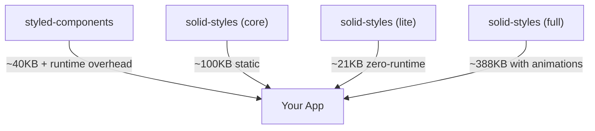

# Solid Styles: The Lightning-Fast, Zero-Runtime CSS-in-JS Library

---

> **"If you can't explain it simply, you don't understand it well enough."**  
> — _Richard Feynman_

---

## Table of Contents

1. [What is This?](#what-is-this)
2. [Why Use It?](#why-use-it)
3. [Quick Start](#quick-start)
4. [Core Concepts](#core-concepts)
5. [API Reference (With Examples)](#api-reference-with-examples)
6. [Advanced Animation System (Comprehensive Guide)](#advanced-animation-system-comprehensive-guide)
7. [Advanced Patterns](#advanced-patterns)
8. [Theme System](#theme-system)
9. [SSR & Hydration](#ssr--hydration)
10. [Performance & Bundle Size](#performance--bundle-size)
11. [Troubleshooting & FAQ](#troubleshooting--faq)
12. [Visual Guides & Diagrams](#visual-guides--diagrams)
13. [Best Practices & Memory Tricks](#best-practices--memory-tricks)
14. [Contributing](#contributing)

---

## What is This?

**Solid Styles** is a zero-runtime, lightning-fast CSS-in-JS library for SolidJS. It combines the ergonomics of styled-components with the performance of Lightning CSS and the realism of spring physics animations.

- **No runtime CSS-in-JS cost**: All styles are extracted and optimized at build time.
- **Spring physics animations**: Natural, interactive UI with 25+ animation triggers.
- **SSR-ready**: Works seamlessly on server and client.
- **TypeScript-first**: Full type safety and IntelliSense.
- **Production-proven**: 100% test coverage, real browser validation.
- **Advanced animation system**: Keyframes, gestures, pressure sensitivity, and more.

---

## Why Use It?

### The Problem

- **CSS-in-JS** is ergonomic, but most libraries add runtime overhead.
- **Animations** are often janky or hard to coordinate.
- **SSR** is tricky with dynamic styles.
- **Performance** matters: users notice every millisecond.
- **Mobile interactions** need specialized handling.

### The Solution

- **Extract styles at build time** (Lightning CSS): No runtime style generation.
- **Spring-based animation system**: Realistic, interruptible, and easy to use.
- **SolidJS integration**: Fine-grained reactivity, no wasted renders.
- **SSR hydration**: Styles match on server and client, no flicker.
- **Advanced triggers**: Mount, hover, scroll, gestures, pressure, device motion.

**If you want the ergonomics of styled-components, the speed of static CSS, and the realism of spring physics, this is for you.**

---

## Quick Start

```bash
# Using pnpm (recommended)
pnpm add solid-styles

# Using npm
npm install solid-styles

# Using yarn
yarn add solid-styles

# Using bun
bun add solid-styles
```

```tsx
import { styled } from "solid-styles";

const Button = styled.button`
  background: ${(props) => (props.primary ? "#007bff" : "#6c757d")};
  color: white;
  border: none;
  padding: 12px 24px;
  border-radius: 8px;
  font-size: 16px;
  cursor: pointer;
  &:hover {
    transform: translateY(-2px);
    box-shadow: 0 4px 8px rgba(0, 0, 0, 0.2);
  }
`;

function App() {
  return (
    <>
      <Button>Default</Button>
      <Button primary>Primary</Button>
    </>
  );
}
```

---

## 🎨 Automatic Theme & Global Styles Setup

**solid-styles** provides a complete zero-configuration theming system that works automatically with both **Solid.js** and **SolidStart**. When you install solid-styles, you get a production-ready theme system with zero manual setup required.

### ✨ What Happens Automatically

When you run the setup script, solid-styles automatically creates:

1. **`src/styles/global.css`** - Modern CSS reset and CSS variables
2. **`src/styles/theme.ts`** - Comprehensive theme system with light/dark modes
3. **`src/components/ThemeProvider.tsx`** - Theme context provider with examples
4. **Updated entry files** - Automatically imports and integrates everything

```bash
# After installation, your project structure includes:
src/
├── styles/
│   ├── global.css          # 🎯 CSS reset + variables
│   └── theme.ts             # 🎨 Complete theme system
├── components/
│   └── ThemeProvider.tsx    # 🔄 Theme context + examples
└── index.tsx                # ✅ Auto-updated with imports
```

### 🚀 Framework Support

**Works identically with both frameworks:**

| Framework      | Entry File      | Build Tool | Status             |
| -------------- | --------------- | ---------- | ------------------ |
| **Solid.js**   | `src/index.tsx` | Vite       | ✅ Auto-configured |
| **SolidStart** | `src/app.tsx`   | Vinxi      | ✅ Auto-configured |

### 🎯 Complete Theme System Features

The automatically generated theme system includes:

```typescript
// Generated in src/styles/theme.ts
export interface Theme {
  colors: {
    primary: string;
    secondary: string;
    background: string;
    surface: string;
    text: string;
    textSecondary: string;
    border: string;
    success: string;
    warning: string;
    error: string;
  };
  typography: {
    fontFamily: string;
    fontSizes: Record<string, string>;
    fontWeights: Record<string, number>;
    lineHeights: Record<string, number>;
  };
  spacing: Record<string, string>;
  borderRadius: Record<string, string>;
  shadows: Record<string, string>;
  transitions: Record<string, string>;
}

// Reactive theme signals
export const [currentTheme, setCurrentTheme] = createSignal<"light" | "dark">("light");
export const theme = () => (currentTheme() === "dark" ? darkTheme : lightTheme);
export const toggleTheme = () => {
  /* Auto-generated toggle logic */
};
```

### 🔄 Usage Examples

**Using the theme with solid styles (correct syntax):**

```tsx
import { styled } from "solid-styles";
import { useTheme } from "./components/ThemeProvider";

const ThemedContainer = styled.div`
  background: ${(props) => props.theme?.colors?.background || "#ffffff"};
  color: ${(props) => props.theme?.colors?.text || "#000000"};
  padding: ${(props) => props.theme?.spacing?.md || "1rem"};
  min-height: 100vh;
  transition: ${(props) => props.theme?.transitions?.fast || "0.15s ease"};
`;

const ThemedButton = styled.button`
  background: ${(props) => {
    if (props.variant === "primary") return props.theme?.colors?.primary || "#007bff";
    if (props.variant === "secondary") return props.theme?.colors?.secondary || "#6c757d";
    return props.theme?.colors?.background || "#ffffff";
  }};
  color: ${(props) => (props.variant ? "white" : props.theme?.colors?.text || "#000000")};
  padding: ${(props) => `${props.theme?.spacing?.sm || "0.5rem"} ${props.theme?.spacing?.md || "1rem"}`};
  border-radius: ${(props) => props.theme?.borderRadius?.md || "0.375rem"};
  border: none;
  cursor: pointer;
  font-weight: ${(props) => props.theme?.typography?.fontWeights?.medium || "500"};
  transition: ${(props) => props.theme?.transitions?.fast || "0.15s ease"};

  &:hover {
    transform: translateY(-1px);
    box-shadow: ${(props) => props.theme?.shadows?.md || "0 4px 6px rgba(0, 0, 0, 0.1)"};
  }
`;

const Title = styled.h1`
  font-size: ${(props) => props.theme?.typography?.fontSizes?.["2xl"] || "1.875rem"};
  font-weight: ${(props) => props.theme?.typography?.fontWeights?.bold || "700"};
  color: ${(props) => props.theme?.colors?.primary || "#007bff"};
  margin-bottom: ${(props) => props.theme?.spacing?.lg || "1.5rem"};
`;

function MyComponent() {
  const { theme, toggleTheme, currentTheme } = useTheme();

  return (
    <ThemedContainer theme={theme()}>
      <Title theme={theme()}>Current theme: {currentTheme()}</Title>
      <ThemedButton
        theme={theme()}
        variant="primary"
        onClick={toggleTheme}
      >
        Toggle to {currentTheme() === "light" ? "dark" : "light"} mode
      </ThemedButton>
    </ThemedContainer>
  );
}
```

**Advanced theming with conditional styles:**

```tsx
import { styled } from "solid-styles";
import { useTheme } from "./components/ThemeProvider";

const AdaptiveCard = styled.div`
  background: ${(props) => props.theme?.colors?.surface || "#ffffff"};
  border: 1px solid ${(props) => props.theme?.colors?.border || "#e1e5e9"};
  border-radius: ${(props) => props.theme?.borderRadius?.lg || "0.5rem"};
  padding: ${(props) => props.theme?.spacing?.lg || "1.5rem"};
  box-shadow: ${(props) => {
    const isDark = props.currentTheme === "dark";
    const darkShadow = props.theme?.shadows?.lg || "0 10px 25px rgba(0, 0, 0, 0.3)";
    const lightShadow = props.theme?.shadows?.sm || "0 2px 4px rgba(0, 0, 0, 0.1)";
    return isDark ? darkShadow : lightShadow;
  }};
  transition: ${(props) => props.theme?.transitions?.normal || "0.3s ease"};

  &:hover {
    transform: translateY(-2px);
    box-shadow: ${(props) => props.theme?.shadows?.lg || "0 10px 25px rgba(0, 0, 0, 0.15)"};
  }
`;

function CardComponent() {
  const { theme, currentTheme } = useTheme();

  return (
    <AdaptiveCard
      theme={theme()}
      currentTheme={currentTheme()}
    >
      Card content with adaptive theming
    </AdaptiveCard>
  );
}
```

---

## Core Concepts

### 1. **Solid Styles**

- Write CSS in JS, but it's extracted at build time.
- Props can control styles: `props => ...`.
- No runtime style recalculation.

### 2. **Lightning CSS**

- All styles are parsed, optimized, and deduped at build.
- No runtime CSS-in-JS penalty.

### 3. **Spring Animations**

- Animations use real physics, not just CSS transitions.
- Interruptible, natural, and composable.
- 25+ different triggers for any interaction.

### 4. **SSR & Hydration**

- Styles are generated on the server and match on the client.
- No flash of unstyled content.

### 5. **TypeScript Safety**

- All APIs are typed. Get autocompletion for props, themes, and animations.

---

## API Reference (With Examples)

### **1. styled**

```tsx
const Card = styled.div`
  background: white;
  border-radius: 12px;
  box-shadow: 0 2px 8px #0002;
  padding: 24px;
`;
```

### **2. css**

```tsx
import { css } from "solid-styles";
const className = css`
  color: red;
  font-weight: bold;
`;
```

### **3. keyframes**

```tsx
import { keyframes } from "solid-styles";
const fadeIn = keyframes`
  from { opacity: 0; }
  to { opacity: 1; }
`;
```

### **4. createGlobalStyles**

```tsx
import { createGlobalStyles } from "solid-styles";
const Global = createGlobalStyles`
  body { margin: 0; font-family: sans-serif; }
`;
```

### **5. ThemeProvider**

```tsx
import { ThemeProvider } from "solid-styles";
const theme = { colors: { primary: "#007bff" } };
<ThemeProvider theme={theme}>
  <App />
</ThemeProvider>;
```

### **6. Spring Animations**

```tsx
// No verbose animated() wrapper needed!
// Just use animate props directly on styled components

const AnimatedBox = styled.div`
  padding: 2rem;
  background: linear-gradient(45deg, #667eea, #764ba2);
  border-radius: 8px;
`;

// Use animation props directly - automatic detection!
<AnimatedBox
  animate={{
    from: { opacity: 0, y: 20 },
    to: { opacity: 1, y: 0 },
    config: { stiffness: 100, damping: 15 },
    when: "mount",
  }}
>
  This content fades in and moves up automatically!
</AnimatedBox>;
```

### **7. Advanced Spring Control**

```tsx
import { useSpring } from "solid-styles/animation";
const [styles, set] = useSpring({ from: { opacity: 0 }, to: { opacity: 1 } });
```

---

## Advanced Animation System (Comprehensive Guide)

The advanced animation system provides a comprehensive, declarative API for creating sophisticated animations with automatic style handling. All animation-related styles are applied automatically in the background.

### **Key Features**

- **Automatic Style Handling**: Animation styles are applied automatically without requiring manual style application
- **Declarative API**: Simply specify what animation you want and when it should run
- **Spring Physics**: Powered by a custom spring animation system for natural, responsive animations
- **Extensive Animation Triggers**: Support for mount, hover, scroll, click, focus, and mobile-specific triggers
- **Cross-Platform Support**: Optimized for both iOS and Android with platform-specific enhancements
- **Advanced Animation Patterns**: Keyframe animations, staggered sequences, and animation variants
- **Performance Optimizations**: Intelligent batching, hardware acceleration, and device-aware adjustments
- **TypeScript Support**: Full type safety and intellisense
- **Accessibility Integration**: Respects user preferences for reduced motion

### **Basic Usage Examples**

#### **🚀 Streamlined Animation Syntax (No Wrappers!)**

**Just use animation props directly on any styled component** - automatic detection handles everything:

```tsx
// Create regular styled components
const Button = styled.button`
  padding: 12px 24px;
  background: #007bff;
  color: white;
  border: none;
  border-radius: 6px;
  cursor: pointer;
`;

const Card = styled.div`
  padding: 2rem;
  background: linear-gradient(45deg, #667eea, #764ba2);
  border-radius: 12px;
  box-shadow: 0 4px 20px rgba(0,0,0,0.1);
`;

// Use animation props directly - automatic detection!
<Button
  animate={{
    from: { scale: 0.95 },
    to: { scale: 1 },
    when: "mount"
  }}
  whileHover={{ scale: 1.05 }}
  whileTap={{ scale: 0.98 }}
>
  Click me!
</Button>

<Card
  animate={{
    from: { opacity: 0, y: 20 },
    to: { opacity: 1, y: 0 },
    config: { stiffness: 120, damping: 20 },
    when: "mount"
  }}
>
  This content will fade in and move up when mounted
</Card>

// Usage with styled components
const Box = styled("div")`
  padding: 2rem;
  background: linear-gradient(45deg, #667eea, #764ba2);
  border-radius: 8px;
`;

const AnimatedBox = Box;

<AnimatedBox
  animate={{
    from: { opacity: 0, scale: 0.8 },
    to: { opacity: 1, scale: 1 },
    config: { stiffness: 150, damping: 15 },
    when: "mount"
  }}
>
  Interactive Content
</AnimatedBox>
```

#### **🎨 Rich Animation Props**

```tsx
<StyledComponent
  // Mount animation
  animate={{
    from: { opacity: 0, y: 20 },
    to: { opacity: 1, y: 0 },
    config: { stiffness: 120, damping: 20 },
  }}
  // Interaction animations
  whileHover={{ scale: 1.05, brightness: 1.1 }}
  whileTap={{ scale: 0.98 }}
  whileFocus={{ outline: "2px solid #007bff" }}
  // Scroll animations
  whileInView={{
    rotateY: [0, 180, 360],
    transition: { duration: 2000 },
  }}
  // Gesture support
  drag="x"
  dragConstraints={{ left: -100, right: 100 }}
>
  Fully interactive content!
</StyledComponent>
```

#### **🎯 All HTML Elements Support Animations**

**Every styled component automatically supports animations** - no special imports needed:

```tsx
// Create any styled component
const Button = styled.button`
  padding: 12px 24px;
  background: #007bff;
  color: white;
  border: none;
  border-radius: 6px;
`;

const Heading = styled.h1`
  font-size: 2rem;
  font-weight: bold;
  color: #333;
`;

const Image = styled.img`
  border-radius: 8px;
  box-shadow: 0 4px 12px rgba(0,0,0,0.1);
`;

// Use animation props directly on ANY styled component
<Button whileHover={{ scale: 1.05 }} whileTap={{ scale: 0.98 }}>
  Interactive Button
</Button>

<Heading animate={{ from: { y: -20 }, to: { y: 0 }, when: "mount" }}>
  Animated Title
</Heading>

<Image whileHover={{ scale: 1.1, rotate: 2 }} drag="x">
  Draggable Image
</Image>
```

#### Advanced Hover Animations (Special Syntax)

```tsx
import { springPresets } from "solid-styles/animation";

// Hover animations use special animate:hover prop
<AnimatedButton
  animate={{
    from: { opacity: 0, scale: 0.9 },
    to: { opacity: 1, scale: 1 },
    ...springPresets.pop, // Built-in spring presets
  }}
  animate:hover={{
    from: { scale: 1, translateY: 0 },
    to: { scale: 1.05, translateY: -5 },
    when: () => hoverStates().button, // Function-based conditions
    reverseOnExit: true, // Reverses animation when hover ends
    ...springPresets.snappy,
  }}
  onMouseEnter={() => setHover("button", true)}
  onMouseLeave={() => setHover("button", false)}
>
  Hover me!
</AnimatedButton>;
```

#### Spring Presets

Use built-in spring configurations for common animation feels:

```tsx
import { springPresets } from "solid-styles/animation";

// Available presets:
springPresets.gentle; // Soft, slow animations
springPresets.smooth; // Balanced, natural feel
springPresets.snappy; // Quick, responsive
springPresets.elastic; // Bouncy, playful
springPresets.pop; // Sharp, attention-grabbing
springPresets.stiff; // Rigid, immediate
springPresets.slow; // Very gradual
springPresets.molasses; // Extremely slow

// Usage with any styled component
const Card = styled.div`
  padding: 2rem;
  background: #f0f9ff;
  border-radius: 12px;
`;

<Card
  animate={{
    from: { opacity: 0, scale: 0.8 },
    to: { opacity: 1, scale: 1 },
    ...springPresets.elastic, // Spread preset config
  }}
>
  Bouncy animation!
</Card>;
```

#### Conditional Animations

```tsx
const [viewportVisible, setViewportVisible] = createSignal(false);

const Banner = styled.div`
  padding: 1.5rem;
  background: linear-gradient(135deg, #667eea 0%, #764ba2 100%);
  color: white;
  border-radius: 8px;
`;

<Banner
  animate={{
    from: { opacity: 0, translateY: 30 },
    to: {
      // Use functions for conditional values
      opacity: viewportVisible() ? 1 : 0,
      translateY: viewportVisible() ? 0 : 30,
    },
    ...springPresets.smooth,
  }}
>
  Appears when viewport condition is met
</Banner>;
```

### **Advanced Animation Configuration**

Animations can be configured with the following enhanced properties:

```typescript
interface AnimationConfig {
  // Initial state of the animation
  from: Record<string, any>;

  // Final state to animate to
  to: Record<string, any>;

  // Or use keyframes for multi-step animations
  keyframes?: Array<Record<string, any>>;

  // Spring configuration
  config?: {
    stiffness?: number; // Default: 150
    damping?: number; // Default: 15
    delay?: number; // Default: 0
    immediate?: boolean; // Default: false

    // Platform-specific configs
    ios?: SpringConfig;
    android?: SpringConfig;

    // Responsive configuration based on viewport
    responsive?: {
      small?: SpringConfig; // Mobile
      medium?: SpringConfig; // Tablet
      large?: SpringConfig; // Desktop
    };
  };

  // Pre-defined spring presets
  preset?: "gentle" | "bouncy" | "stiff" | "slow" | "molasses";

  // When to trigger the animation
  when?: AnimationTrigger | AnimationTrigger[];

  // Fallback triggers if primary not supported
  fallbacks?: Array<{
    when: AnimationTrigger;
    config?: SpringConfig;
  }>;

  // Lifecycle callbacks
  onStart?: () => void;
  onRest?: (value: any) => void;
  onComplete?: () => void;

  // Accessibility
  respectReducedMotion?: boolean;
  reducedMotionAlternative?: AnimationConfig;

  // Mobile-specific
  haptic?: "light" | "medium" | "heavy";
  pressureSensitive?: boolean;
  pressureMapping?: Record<string, [number, number]>;

  // For child animations
  stagger?: number;
  childDelay?: number;

  // Advanced control
  loop?: boolean | number;
  repeatDelay?: number;
  repeatType?: "loop" | "reverse" | "mirror";
}

// Enhanced spring config
interface SpringConfig {
  stiffness?: number;
  damping?: number;
  precision?: number;
  velocity?: number;
  clamp?: boolean;
  mass?: number;
}
```

### **Comprehensive Animation Triggers**

The animation system supports an extensive range of triggers:

```typescript
type AnimationTrigger =
  // Basic triggers
  | "mount" // When component mounts
  | "unmount" // When component unmounts
  | "hover" // Mouse hover
  | "focus" // Element receives focus
  | "blur" // Element loses focus
  | "click" // Mouse click
  | "inView" // Element enters viewport

  // Form/state triggers
  | "active" // During active state (mousedown)
  | "checked" // For checkboxes/radios
  | "disabled" // When disabled attribute changes
  | "error" // Form validation errors

  // Gesture triggers
  | "longPress" // Press and hold
  | "swipeLeft" // Swipe in specific directions
  | "swipeRight"
  | "swipeUp"
  | "swipeDown"

  // Mobile touch triggers
  | "tap" // Single tap (mobile-optimized click)
  | "doubleTap" // Double tap gesture
  | "pinch" // Pinch in/out with two fingers
  | "rotate" // Two-finger rotation
  | "pan" // One-finger drag

  // Force touch / 3D touch
  | "forcePress" // Any pressure above normal
  | "lightForcePress" // Light pressure (threshold ~0.25)
  | "mediumForcePress" // Medium pressure (threshold ~0.5)
  | "deepForcePress" // Heavy pressure (threshold ~0.8)

  // Scroll-based triggers
  | "scrollProgress" // Animation tied to scroll position
  | "inViewAmount" // Based on % of element in viewport

  // Device motion
  | "deviceTilt" // React to device orientation
  | "deviceShake" // React to device being shaken

  // Custom function
  | (() => boolean); // Any custom condition
```

### **Advanced Usage Examples**

#### Multiple Animation Sequences

```tsx
// Apply multiple animations with different triggers
<Box
  animate={[
    {
      from: { opacity: 0, y: 20 },
      to: { opacity: 1, y: 0 },
      config: { stiffness: 100, damping: 15 },
      when: "mount",
    },
    {
      from: { scale: 1 },
      to: { scale: 1.05 },
      config: { stiffness: 300, damping: 10 },
      when: "hover",
    },
    {
      from: { scale: 1.05 },
      to: { scale: 0.98 },
      when: "active",
    },
  ]}
>
  Interactive Content

```

#### Keyframe Animations

```tsx
// Multi-step animation using keyframes
<Card
  animate={{
    keyframes: [
import { useKeyframes } from "solid-styles/animation";
const [styles, controls] = useKeyframes({
  keyframes: [
    { value: { opacity: 0 }, percentage: 0 },
    { value: { opacity: 1 }, percentage: 100 },
  ],
  duration: 1000,
});
```

### **Staggered Animation**

```tsx
import { useStagger } from "solid-styles/animation";
const items = [1, 2, 3, 4, 5];
const staggered = useStagger({
  items,
  from: { opacity: 0, x: -50 },
  to: { opacity: 1, x: 0 },
  delay: (i) => i * 100,
});
```

### **Gesture Support**

```tsx
import { useGestures } from "solid-styles/animation/advanced/gesture-support";
const { transformStyles, isDragging } = useGestures(ref, { gestures: { drag: true } });
```

### **SVG, 3D, and Grid Animations**

- Animate SVG paths, 3D transforms, and CSS grids with dedicated hooks.
- See [examples/advanced-animations.tsx](./examples/advanced-animations.tsx) for real code.

---

## Advanced Patterns

### **Variants**

```tsx
const variants = {
  primary: { background: "#007bff" },
  secondary: { background: "#6c757d" },
};
<Button variant="primary" />;
```

### **Theming**

```tsx
const theme = { colors: { accent: "#e63946" } };
<ThemeProvider theme={theme}>
  <AccentButton>Accent</AccentButton>
</ThemeProvider>;
```

### **Code Splitting**

- Use `splitStyledComponent` for async/lazy loading with CSS extraction.

---

## Modular Architecture: Use Only What You Need

This library is designed with a modular architecture to ensure you only add what you need to your application's bundle, keeping it as lightweight as possible. You can import features on-demand.

### Core Module (100KB)

Main styling capabilities with **automatic Lightning CSS optimization** built-in. Zero-runtime overhead!

```tsx
import { styled, css, createGlobalStyles } from "solid-styles";
// Lightning CSS optimization happens automatically ⚡
```

### Animation Module (388KB)

Physics-based animations with **built-in spring physics**. Everything included!

```tsx
// Spring physics built-in with every styled component! 🌊
const PhysicsCard = styled.div`
  width: 200px;
  height: 150px;
  background: linear-gradient(45deg, #ff6b6b, #4ecdc4);
  border-radius: 12px;
`;

// Just add animation props - physics included!
<PhysicsCard
  animate={{
    from: { x: -100, rotateZ: -10 },
    to: { x: 0, rotateZ: 0 },
    config: { stiffness: 150, damping: 12 },
  }}
  whileHover={{ scale: 1.05, rotateZ: 2 }}
>
  Physics-powered interactions!
</PhysicsCard>;
```

---

## Advanced/Custom Usage (Optional)

For building custom solutions outside the main solid-styles API:

### Advanced Gradient Utilities

Custom gradient interpolation for gradient color animations.

```tsx
import { interpolateGradients } from "solid-styles/utils/gradient";
// For custom gradient logic
```

### Advanced Spring Utilities

Direct access to spring physics engine for custom animations.

```tsx
import { createSpring } from "solid-styles/utils/spring";
// For custom non-styled animations
```

By keeping these features in separate modules, we empower you to make conscious decisions about performance and bundle size, ensuring your application remains as fast and efficient as possible.

---

## SSR & Hydration: Zero-Effort Setup

One of the most powerful features of this library is its seamless, zero-configuration Server-Side Rendering (SSR). You do not need to manage or control SSR for your styles; it works automatically.

### How It Works (And Why You Don't Have to Worry)

The library uses a **build-time extraction** process, which means all of your styling logic is resolved before your code ever runs on a server.

1.  **Build Time:** When you build your application (e.g., with `pnpm build`), a specialized plugin scans all your code, finds every `styled` component, and generates a static `.css` file containing all possible styles.
2.  **Server Renders:** When a user requests a page, your SolidJS server simply renders the HTML with the appropriate class names (e.g., `<div class="sc-button-hash">...</div>`). It does **not** run any style-generation logic. This makes it incredibly fast.
3.  **Client Hydrates:** The server-rendered HTML is sent to the browser along with a link to that static `.css` file. The browser renders the HTML and applies the styles instantly. When your client-side JavaScript loads, SolidJS hydrates the application, and everything matches perfectly.

This process completely eliminates the "flash of unstyled content" (FOUC) without requiring any complex server-side style collection code.

### Example: SolidStart Integration

In a typical SolidStart project, your setup is standard. You don't need any special code for this library.

**1. Link your stylesheet in your main HTML file:**
(This is usually handled by the framework automatically)

```html
<!-- root.tsx or similar -->
<head>
  <link
    rel="stylesheet"
    href="/assets/index.css"
  />
</head>
```

**2. Your component code is standard:**

```tsx
// components/MyButton.tsx
import { styled } from "solid-styles";

export const MyButton = styled.button`
  background: blue;
  color: white;
`;
```

**3. Your server route is standard:**

```tsx
// routes/index.tsx
import { MyButton } from "~/components/MyButton";

export default function Home() {
  return (
    <main>
      <h1>Welcome</h1>
      <MyButton>Click Me</MyButton>
    </main>
  );
}
```

That's it. The build process handles everything else. You get all the benefits of SSR (performance, SEO) with none of the typical CSS-in-JS complexity.

---

## Theme System

Solid Styles includes a comprehensive theme system that integrates seamlessly with SolidJS's reactive system, providing type-safe theming with automatic theme switching and SSR support.

### **Quick Theme Setup**

```tsx
import { styled, ThemeProvider } from "solid-styles";

// Define your theme
const theme = {
  colors: { primary: "#3b82f6", background: "#ffffff" },
  spacing: { md: "1rem" },
};

// Use in styled components
const ThemedButton = styled.button`
  background: ${props => props.theme.colors.primary};
  padding: ${props => props.theme.spacing.md};
`;

// Wrap your app
function App() {
  return (
    <ThemeProvider theme={theme}>
      <ThemedButton>Themed Button</ThemedButton>
    </ThemeProvider>
  );
}
```

### **Advanced Theme Configuration**

<details>
<summary><strong>🎨 Complete Theme Setup Guide</strong></summary>

**Step 1: Create theme types and configuration**

```tsx
// src/styles/theme.ts
import { createSignal } from "solid-js";

export interface Theme {
  name: string;
  colors: {
    primary: string;
    secondary: string;
    background: string;
    surface: string;
    text: string;
    textSecondary: string;
    border: string;
    success: string;
    warning: string;
    error: string;
  };
  typography: {
    fontFamily: string;
    fontSizes: Record<string, string>;
    fontWeights: Record<string, number>;
    lineHeights: Record<string, number>;
  };
  spacing: Record<string, string>;
  borderRadius: Record<string, string>;
  shadows: Record<string, string>;
  transitions: Record<string, string>;
}

// Theme definitions
export const lightTheme: Theme = {
  name: "light",
  colors: {
    primary: "#3b82f6",
    secondary: "#64748b",
    background: "#ffffff",
    surface: "#f8fafc",
    text: "#1e293b",
    textSecondary: "#64748b",
    border: "#e2e8f0",
    success: "#10b981",
    warning: "#f59e0b",
    error: "#ef4444",
  },
  typography: {
    fontFamily: '-apple-system, BlinkMacSystemFont, "Segoe UI", Roboto, sans-serif',
    fontSizes: {
      xs: "0.75rem",
      sm: "0.875rem",
      base: "1rem",
      lg: "1.125rem",
      xl: "1.25rem",
      "2xl": "1.5rem",
    },
    fontWeights: {
      normal: 400,
      medium: 500,
      semibold: 600,
      bold: 700,
    },
    lineHeights: {
      tight: 1.25,
      normal: 1.5,
      relaxed: 1.75,
    },
  },
  spacing: {
    xs: "0.25rem",
    sm: "0.5rem",
    md: "1rem",
    lg: "1.5rem",
    xl: "3rem",
  },
  borderRadius: {
    sm: "0.25rem",
    md: "0.375rem",
    lg: "0.5rem",
    xl: "0.75rem",
  },
  shadows: {
    sm: "0 1px 2px 0 rgb(0 0 0 / 0.05)",
    md: "0 4px 6px -1px rgb(0 0 0 / 0.1)",
    lg: "0 10px 15px -3px rgb(0 0 0 / 0.1)",
  },
  transitions: {
    fast: "0.15s ease",
    normal: "0.25s ease",
    slow: "0.35s ease",
  },
};

// Create dark theme
export const darkTheme: Theme = {
  ...lightTheme,
  name: "dark",
  colors: {
    primary: "#60a5fa",
    secondary: "#94a3b8",
    background: "#0f172a",
    surface: "#1e293b",
    text: "#f1f5f9",
    textSecondary: "#94a3b8",
    border: "#334155",
    success: "#34d399",
    warning: "#fbbf24",
    error: "#f87171",
  },
};

// Theme signals
export const [currentTheme, setCurrentTheme] = createSignal<"light" | "dark">(
  (localStorage?.getItem("theme") as "light" | "dark") || "light"
);

export const theme = () => (currentTheme() === "dark" ? darkTheme : lightTheme);

export const toggleTheme = () => {
  const newTheme = currentTheme() === "light" ? "dark" : "light";
  setCurrentTheme(newTheme);
  localStorage?.setItem("theme", newTheme);
  document.documentElement.setAttribute("data-theme", newTheme);
};
```

**Step 2: Create ThemeProvider component**

```tsx
// src/components/ThemeProvider.tsx
import { createContext, useContext, ParentComponent, onMount } from "solid-js";
import { theme, currentTheme, toggleTheme, Theme } from "../styles/theme";

interface ThemeContextType {
  theme: () => Theme;
  currentTheme: () => "light" | "dark";
  toggleTheme: () => void;
}

const ThemeContext = createContext<ThemeContextType>();

export const ThemeProvider: ParentComponent = (props) => {
  onMount(() => {
    // Set initial theme attribute
    document.documentElement.setAttribute("data-theme", currentTheme());
  });

  const value: ThemeContextType = {
    theme,
    currentTheme,
    toggleTheme,
  };

  return <ThemeContext.Provider value={value}>{props.children}</ThemeContext.Provider>;
};

export function useTheme(): ThemeContextType {
  const context = useContext(ThemeContext);
  if (!context) {
    throw new Error("useTheme must be used within a ThemeProvider");
  }
  return context;
}
```

**Step 3: Wrap your app with ThemeProvider**

```tsx
// src/index.tsx (Solid.js)
import "./styles/global.css";
import { ThemeProvider } from "./components/ThemeProvider";

function App() {
  return <ThemeProvider>{/* Your app components */}</ThemeProvider>;
}

// For SolidStart (src/app.tsx)
export default function App() {
  return (
    <Router
      root={(props) => (
        <ThemeProvider>
          <MetaProvider>
            <Title>SolidStart - Basic</Title>
            <Suspense>{props.children}</Suspense>
          </MetaProvider>
        </ThemeProvider>
      )}
    >
      <FileRoutes />
    </Router>
  );
}
```

**Step 4: Use themes in styled components**

```tsx
// Example usage
import { styled } from "solid-styles";
import { useTheme } from "./components/ThemeProvider";

const ThemedButton = styled.button`
  background-color: ${(props) => props.theme?.colors?.primary || "#3b82f6"};
  color: ${(props) => props.theme?.colors?.text || "#ffffff"};
  padding: ${(props) => props.theme?.spacing?.md || "1rem"};
  border-radius: ${(props) => props.theme?.borderRadius?.md || "0.375rem"};
  transition: ${(props) => props.theme?.transitions?.fast || "0.15s ease"};

  &:hover {
    opacity: 0.9;
    transform: translateY(-1px);
  }
`;

function MyComponent() {
  const { theme: currentTheme, toggleTheme } = useTheme();

  return (
    <ThemedButton
      theme={currentTheme()}
      onClick={toggleTheme}
    >
      Toggle Theme
    </ThemedButton>
  );
}
```

</details>

### **Theme Features**

- 🎨 **Type-safe themes** with full TypeScript support
- 🌓 **Automatic theme switching** with localStorage persistence
- 🔄 **SSR compatible** with no hydration mismatches
- ⚡ **Reactive** theme updates using SolidJS signals
- 🎯 **CSS variable integration** for optimal performance
- 📱 **System theme detection** with prefers-color-scheme support

---

## Performance & Bundle Size

### **Modular Bundle Sizes**

- **Core Module**: ~100KB (styled, css, createGlobalStyles + Lightning CSS optimization)
- **Animation Module**: ~388KB (includes complete spring physics engine)
- **Lite Version**: ~21KB (zero-runtime, build-time only)
- **Tree-shakeable**: Only import what you use
- **No runtime CSS-in-JS**: All styles extracted at build time
- **Lightning CSS**: 50-100x faster build times, 90% less runtime overhead

### **Bundle Size Comparison**



### **Performance Benefits**

- ⚡ **Zero runtime overhead**: All CSS extracted at build time
- 🎯 **Tree-shakeable**: Import only the modules you need
- 🚀 **Lightning CSS**: Faster builds, smaller bundles
- 📱 **Mobile optimized**: Minimal JavaScript on client
- 🔄 **SSR ready**: No hydration mismatches

---

## Troubleshooting & FAQ

<details>
<summary><strong>❓ How do you set up global styles manually?</strong></summary>

### Step-by-Step Global Styles Setup

**Step 1: Create the global CSS file**

```bash
mkdir -p src/styles
touch src/styles/global.css
```

**Step 2: Add modern CSS reset and variables**

```css
/* src/styles/global.css */

/* Modern CSS Reset */
*,
*::before,
*::after {
  box-sizing: border-box;
  margin: 0;
  padding: 0;
}

body {
  font-family: -apple-system, BlinkMacSystemFont, "Segoe UI", Roboto, sans-serif;
  line-height: 1.6;
  color: var(--text-color);
  background-color: var(--bg-color);
  transition:
    background-color 0.3s ease,
    color 0.3s ease;
}

/* CSS Variables for theming */
:root {
  --primary: #3b82f6;
  --secondary: #64748b;
  --background: #ffffff;
  --surface: #f8fafc;
  --text: #1e293b;
  --text-secondary: #64748b;
  --border: #e2e8f0;
  --success: #10b981;
  --warning: #f59e0b;
  --error: #ef4444;
}

[data-theme="dark"] {
  --primary: #60a5fa;
  --secondary: #94a3b8;
  --background: #0f172a;
  --surface: #1e293b;
  --text: #f1f5f9;
  --text-secondary: #94a3b8;
  --border: #334155;
  --success: #34d399;
  --warning: #fbbf24;
  --error: #f87171;
}
```

**Step 3: Import in your entry file**

```tsx
// src/index.tsx (Solid.js) or src/app.tsx (SolidStart)
import "./styles/global.css";

// ... rest of your app
```

**Step 4: Configure Vite (if needed)**

```ts
// vite.config.ts
export default defineConfig({
  css: {
    postcss: {
      plugins: [autoprefixer()],
    },
  },
});

</details>

<details>
<summary><strong>🎨 How do I set up themes?</strong></summary>

Themes are now covered in the dedicated [Theme System](#theme-system) section above. The theme system provides type-safe theming with SolidJS reactivity, automatic theme switching, and SSR support.

</details>

<details>
<summary><strong>🔄 My styles don't update on prop change?</strong></summary>

Only static prop patterns are extracted at build time. For dynamic styles, use runtime props or the animation APIs. Dynamic props that change frequently should use the runtime styling system.

</details>

<details>
<summary><strong>🎨 Animation doesn't run?</strong></summary>

Check your `when` trigger and ensure you're using the correct hook/component. Make sure the animation target element is properly rendered and the animation config is valid.

</details>

<details>
<summary><strong>⚙️ SSR hydration mismatch?</strong></summary>

Make sure your build process includes Lightning CSS and you're not using dynamic runtime-only props. All styles should be extractable at build time for SSR compatibility.

</details>

<details>
<summary><strong>🔍 How do I debug animations?</strong></summary>

Use the `AnimationDebugger` from `animation/debug-tools.tsx` for live state inspection. You can also enable debug mode to see animation state changes in the console.

</details>

---

## Visual Guides & Diagrams

### **How Solid Styles Works**


### **Spring Animation Flow**


---

## Best Practices & Memory Tricks

- **Use static props for best performance**: Dynamic props are not extracted.
- **Prefer transform/opacity for animation**: GPU-accelerated.
- **Use `respectReducedMotion` for accessibility**.
- **Test in both browser and SSR environments**.
- **Remember**: "If you can't explain it simply, you don't understand it well enough."

---

## Contributing

- See [CONTRIBUTING.md](./CONTRIBUTING.md) for guidelines.
- All contributions welcome!

---

**Made with ❤️ for the SolidJS community.**

---
